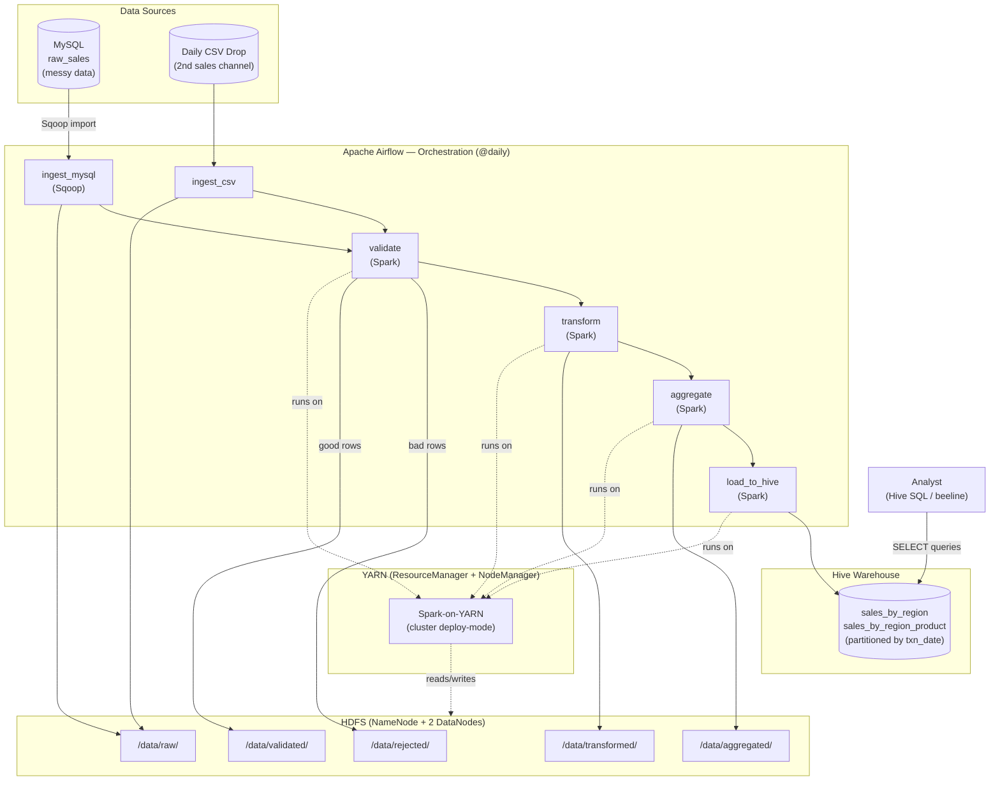

# Sales Analytics Batch Pipeline

A production-style, end-to-end **batch data pipeline** built entirely on
Apache Hadoop, Spark, Hive, Sqoop, and Airflow — no Kubernetes, no
microservices, no cloud managed services. Everything runs as Docker
containers orchestrating real, self-managed big-data infrastructure.

Raw daily sales data from two channels (a MySQL "operational" DB and a
daily CSV drop) is ingested, validated against a data-quality gate,
cleaned/transformed, aggregated, and loaded into a Hive data warehouse
— fully orchestrated and scheduled by Apache Airflow.

## Architecture



## Pipeline Stages

| Stage | Tool | What it does |
|---|---|---|
| **Ingest** | Sqoop + Spark | Imports `raw_sales` from MySQL into HDFS with a deterministic `--columns` order; moves the day's CSV drop into HDFS |
| **Validate** | Spark on YARN | Checks required fields for nulls (including Sqoop's `\N` marker), flags duplicate order/txn IDs, quarantines bad rows to `/data/rejected/` with a `reject_reason`, and **fails the job (exit code 1) if >5% of rows are rejected** — the data quality gate |
| **Transform** | Spark on YARN | Standardizes 4 mixed date formats into one, takes the absolute value of erroneous negative quantities (flagging them), unifies the MySQL and CSV schemas into one common schema, deduplicates |
| **Aggregate** | Spark on YARN | Computes daily rollups: total revenue/units/transactions by region, top products by revenue, region×product breakdown |
| **Load** | Spark on YARN + Hive | Loads aggregated data into Hive tables partitioned by `txn_date`, using dynamic-partition `INSERT OVERWRITE` for idempotent re-runs |

## Stack

- **Hadoop 3.2.1** — HDFS (1 NameNode + 2 DataNodes) + YARN (1 ResourceManager + 1 NodeManager)
- **Apache Spark** (PySpark 2.4.8, chosen for Python 3.5 compatibility with the NodeManager's OS) — all four Spark jobs run in `--deploy-mode cluster` on YARN
- **Apache Hive 2.3.2** — Postgres-backed metastore, Parquet-backed partitioned warehouse tables
- **Apache Sqoop 1.4.7** — custom-built client image (no official maintained image exists)
- **Apache Airflow 2.7.3** — LocalExecutor + dedicated Postgres backend; orchestrates via `docker exec` into the running Sqoop/Spark containers (the scheduler has Docker-socket access)
- **MySQL 8.0** — simulated "operational" source system with intentionally messy data (duplicates, nulls, inconsistent date formats, erroneous negative quantities)
- Everything wired together with a single `docker-compose.yml`

## Repository Layout
├── docker-compose.yml # every service: Hadoop, Hive, MySQL, Sqoop, Spark, Airflow
├── hadoop-config/ # hadoop.env, nodemanager entrypoint (auto-installs python3 on restart)
├── hive-config/
├── sqoop/ # custom Sqoop client Dockerfile + generated Hadoop conf XMLs
├── spark-client/ # custom Spark client Dockerfile (PySpark 2.4.8 + Hadoop 3.2.1)
├── spark-jobs/ # validate.py, transform.py, aggregate.py, load_to_hive.py
├── mysql-init/ # schema + messy-data generator + CSV-drop generator
├── airflow/dags/ # sales_pipeline_dag.py
└── docs/ # test result write-ups (idempotency, data quality gate, failure recovery)


## Running It

```bash
docker compose up -d --scale datanode=2 namenode datanode resourcemanager nodemanager1 historyserver
# wait ~45s, then leave safe mode if needed
docker exec -it namenode hdfs dfsadmin -safemode leave

docker compose up -d hive-metastore-postgresql
docker compose up -d hive-metastore
docker compose up -d hive-server mysql sqoop-client spark-client airflow-webserver airflow-scheduler
```

Airflow UI: `http://<host>:8090` (default admin/admin). Trigger the
`sales_analytics_batch_pipeline` DAG manually or let the `@daily`
schedule run it.

> **Known limitation**: HDFS DataNode storage in this compose setup is
> not backed by a named volume (a deliberate trade-off after hitting
> Docker Compose's `--scale` + single-volume limitation). A full
> `docker compose down`/`up` cycle loses existing HDFS blocks —
> re-run the pipeline from `ingest_mysql` forward after any full
> restart. Source data in MySQL/CSV is always available for
> reprocessing, which is a normal and acceptable recovery model for a
> daily batch system.

## Querying the Warehouse

```sql
-- total revenue by region for the last 7 days
SELECT region, SUM(total_revenue) AS revenue_last_7_days
FROM sales_by_region
WHERE txn_date >= date_sub(current_date(), 7)
GROUP BY region
ORDER BY revenue_last_7_days DESC;

-- top 10 products this month
SELECT product_name, SUM(total_revenue) AS monthly_revenue
FROM sales_by_region_product
WHERE month(txn_date) = month(current_date())
GROUP BY product_name
ORDER BY monthly_revenue DESC
LIMIT 10;
```

## What Was Genuinely Hard (and how it was solved)

This project deliberately targeted the hard parts of *batch* data
engineering — a different skill tree from live/request-driven systems:

- **Idempotency** — `INSERT OVERWRITE TABLE ... PARTITION` in
  `load_to_hive.py` means re-running any date replaces that partition
  cleanly. Verified: re-running an already-processed date produced
  byte-identical row counts and revenue totals (see
  `docs/idempotency_test.md`).
- **Data quality gate** — `validate.py` exits non-zero when the reject
  rate exceeds 5%, which Airflow surfaces as a task failure, correctly
  blocking `transform`/`aggregate`/`load_to_hive` from ever running.
  Verified by injecting 5,000 bad rows and confirming an 11.80% reject
  rate halted the DAG before Load (see `docs/data_quality_gate_test.md`).
- **Failure recovery** — killing a running Spark job mid-execution and
  letting Airflow's retry mechanism (exponential backoff) resume it
  produces a consistent final state with no duplicate or missing rows
  (see `docs/failure_recovery_test.md`).
- **Sqoop's non-deterministic column order** — `SELECT t.*` sometimes
  returns columns alphabetically instead of in table-declaration
  order (a JVM/codegen quirk), silently corrupting downstream schema
  assumptions. Fixed permanently with an explicit `--columns` flag.
- **Ephemeral container state** — custom Docker images (Sqoop, Spark
  clients) don't ship the env-to-XML config generation that the
  `bde2020` Hadoop images have; hand-written `core-site.xml` /
  `hdfs-site.xml` / `mapred-site.xml` / `yarn-site.xml` had to be
  authored and bind-mounted in.
- **Python version mismatch across the cluster** — the NodeManager's
  OS (Debian Stretch, EOL) only supports Python 3.5, which is
  incompatible with PySpark 3.x's `serializers.py`. All four Spark
  jobs are written without f-strings and pinned to PySpark 2.4.8 for
  this reason — PySpark version must match the *execution* environment
  (NodeManager), not the submission client.

See `docs/` for full write-ups with logs and evidence for each test.
